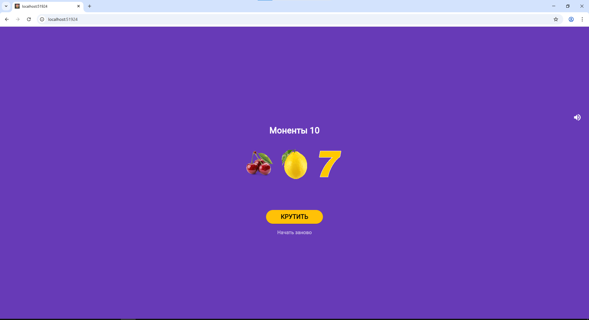
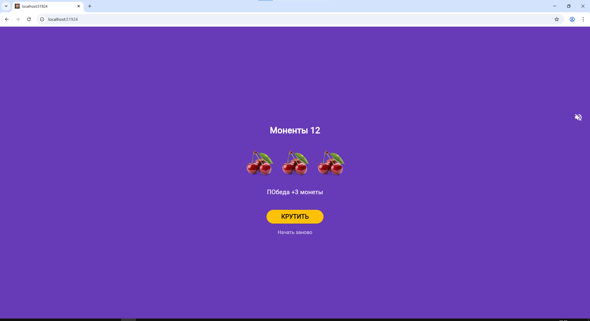
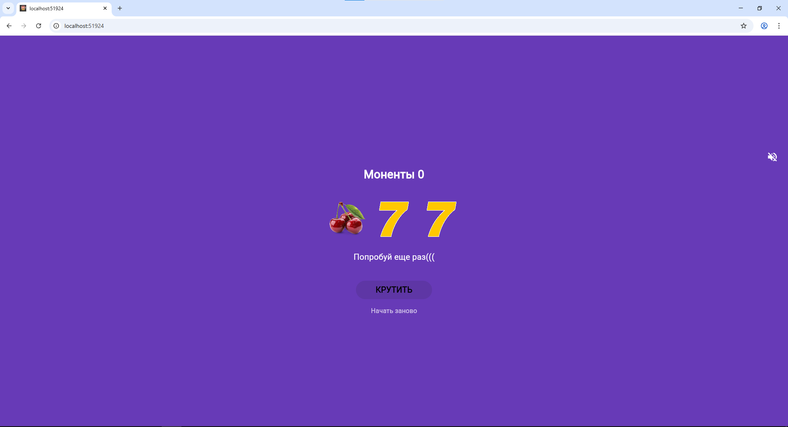

# Учебное приложение. 🎰 Слот-машина
##  Автор
**Текутова В.Д.** — группа ИСП-231
Простое Flutter-приложение — симулятор казино. Крути барабаны, собирай одинаковые символы и выигрывай монеты!

## 📱 Скриншоты

|                 Главный экран                 |                Победа                 |             Монеты закончились             |
| :-------------------------------------------: | :-----------------------------------: | :----------------------------------------: |
|  |  |  |

##  Как играть

- Нажмите **КРУТИТЬ**, чтобы запустить барабаны
- Три одинаковых символа — победа (+3 монеты)
- Три семёрки — джекпот (+10 монет)
- Разные символы — проигрыш (–1 монета)
- Начните заново кнопкой **Начать заново**

##  Запуск проекта

**Требования:** Flutter 3.x, Dart 3.x

```bash
# Клонировать репозиторий
git clone https://github.com/vikatekutova7-ui/Flutter_Lab7

# Перейти в папку проекта
cd slot_machine

# Установить зависимости
flutter pub get

# Запустить в Chrome
flutter run -d chrome
```

##  Установка на Android

Скачайте готовый APK:  
[app-release.apk](build/app/outputs/flutter-apk/app-release.apk)

##  Технологии

- **Flutter** 3.41.2
- **Dart** 3.11.0
- Платформы: Web, Android

## Что изучено

- StatefulWidget и управление состоянием через `setState()`
- Работа с локальными изображениями через `Image.asset()`
- Генерация случайных чисел через `dart:math`
- Анимация через `async/await` и `AnimatedOpacity`
- Создание иконки в Krita и подключение через `flutter_launcher_icons`
- Сборка под Web и Android


