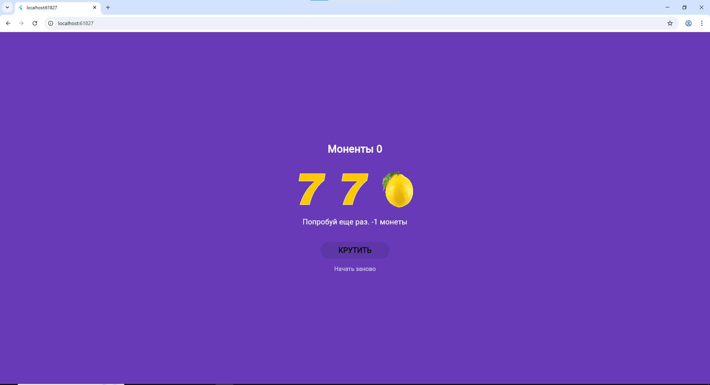

# Лабораторная работа №6: Flutter: StatefulWidget и управление состоянием

## Информация об авторе
- **Фамилия, имя:** Текутова Вика
- **Группа:** ИСП 231 
- **Дата сдачи:** 29.04.26

## Что изучили в ходе работы
- **StatefulWidget и State** – поняли разницу между статическими и динамическими виджетами, научились управлять состоянием через `setState()`.
- **Асинхронная анимация** – реализовали реалистичное вращение барабанов с тремя фазами скорости и поочерёдной остановкой с помощью `Future.delayed` и рекурсивных вызовов.
- **Блокировка UI во время выполнения операций** – добавили флаг `_isSpinning`, который отключает кнопки и предотвращает повторные нажатия.
- **Визуальная обратная связь** – использовали `AnimatedOpacity` для мигания барабанов, `AnimatedSwitcher` для плавной смены текста результата.
- **Разделение на виджеты** – вынесли строку барабанов в отдельный компонент `SlotRow` для улучшения читаемости и переиспользования кода.

## Скриншот финального приложения

## Инструкция по запуску

1. Клонируйте репозиторий:  
   
    git clone <URL вашего репозитория>
   
2.Перейдите в папку проекта

    cd slot_machine
    
3.Установите зависимости
    
    flutter pub get
    
4.Запустите приложение
    
    flutter run -d chrome
    